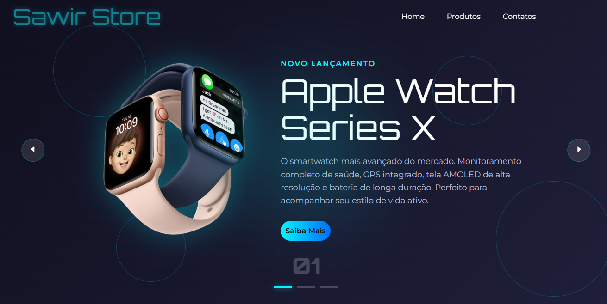

# Protótipo E-commerce — Sawir Store

## 🚀 Sobre o Projeto

Este repositório alberga o protótipo conceitual da **Sawir Store**, uma boutique fictícia especializada na curadoria de dispositivos tecnológicos inovadores. O projeto foi meticulosamente desenhado para simular uma experiência de compra online fluida e visualmente impactante, servindo como um portfólio prático de competências em desenvolvimento front-end.

A arquitetura do design privilegia a clareza e a interação, com o objetivo de converter o interesse do visitante em uma jornada de descoberta agradável e intuitiva.

## ✨ Funcionalidades Implementadas

O projeto materializa-se através das seguintes características principais:

* **Design Responsivo e Fluido**: Arquitetura de front-end totalmente adaptativa, garantindo uma navegação otimizada e consistente em desktops, tablets e smartphones.
* **Experiência de Usuário (UX) Dinâmica**: Interface centrada no usuário, com microinterações e transições suaves que visam engajar e facilitar a jornada de compra.
* **Carrossel de Produtos Interativo**: Componente de destaque para os principais produtos (como Apple Watch Series X, AirPods Max e Vision Pro), permitindo uma exploração visual e interativa que captura a atenção do usuário imediatamente.

## 🛠️ Tecnologias Utilizadas

A execução deste protótipo foi orquestrada com as tecnologias fundamentais do desenvolvimento web, aplicando as melhores práticas do mercado:

* **HTML5**: Utilizado para a estruturação semântica do conteúdo, garantindo acessibilidade e uma base sólida e bem organizada para a aplicação.
* **CSS3**: Empregado para a estilização avançada, animações e a criação do layout responsivo através de técnicas modernas como Flexbox e/ou Grid Layout.
* **JavaScript (ES6+)**: Responsável por orquestrar toda a interatividade e dinamismo da página, desde a manipulação do DOM no carrossel de produtos até a gestão de eventos do usuário.

---